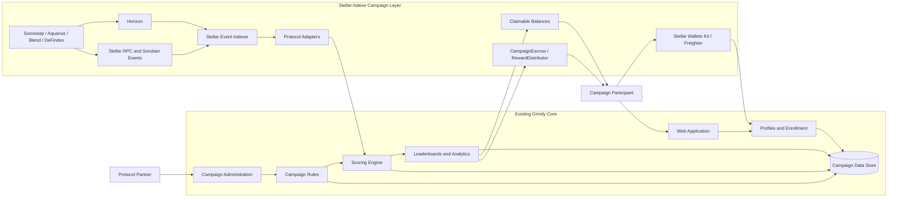
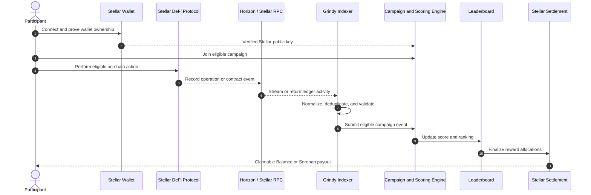

# Grindy Stellar Technical Architecture

## 0. Executive Summary

Grindy is a live B2B campaign infrastructure product for crypto and DeFi protocols. Its current production engine supports campaign creation, participant enrollment, scoring, leaderboards, analytics, and reward operations. The existing MVP validates this model through read-only CEX integrations and completed campaign seasons.

The Stellar-native expansion extends that proven campaign engine with Stellar identity, activity data, scoring inputs, and reward settlement for campaigns based on swaps, liquidity provision, lending supply, and yield allocation. It adds verified wallet linking, on-chain event indexing, protocol adapters, Stellar campaign rules, and native settlement.

Grindy never takes custody of participant trading funds. Users interact directly with Stellar wallets and DeFi protocols. Protocol partners define campaigns and fund their reward pools.

## 1. Product Today

Grindy already operates the reusable product core required for protocol-funded campaigns:

- campaign dashboard and campaign management;
- user profiles and campaign enrollment;
- configurable campaign rules and eligibility periods;
- scoring and leaderboard calculation;
- reward records and settlement operations;
- participant and campaign analytics;
- read-only CEX API tracking;
- administration and campaign monitoring.

The current campaign model has been validated with real usage:

| Metric | Current traction |
| --- | ---: |
| Tracked trading volume | USD 310,000+ |
| Tracked trades | 5,300+ |
| Rewards distributed | USD 1,300+ |
| Registered users | 80+ |
| Active users | 30+ |
| Campaign seasons launched and settled | 3 |

The Stellar-native architecture preserves this campaign engine. It changes how participant identity is verified, how eligible activity is collected, and how rewards are settled.

## 2. Current vs Stellar-Native Architecture

| Product capability | Current Grindy | Stellar-native Grindy | Scope |
| --- | --- | --- | --- |
| Participant identity | Grindy user profile | Grindy profile linked to a verified Stellar public key | Existing core with Stellar connection |
| Campaign enrollment | Profile-based campaign join | Wallet-qualified enrollment against Stellar campaign rules | Existing core with Stellar connection |
| Activity tracking | Read-only CEX APIs and DEX beta data | Horizon, Stellar RPC, Soroban events, and protocol adapters | New Stellar-native data layer |
| Campaign rules | Exchange, pair, period, and volume rules | Protocol, pool, asset, action, duration, and ledger-time rules | Existing rule engine extended for Stellar |
| Scoring | Normalized trade events scored by campaign rules | Normalized on-chain actions scored by the same campaign engine | Existing core with Stellar event inputs |
| Leaderboards | Campaign participant rankings | Stellar wallet-linked rankings with on-chain provenance | Existing and reusable |
| Reward preparation | Reward records and administrative settlement | Final allocations linked to Stellar accounts and a settlement manifest | Existing core with Stellar connection |
| Simple reward settlement | Administrative payout flow | Claimable Balances | New Stellar-native settlement lane |
| Advanced reward settlement | Not available on-chain | Soroban campaign escrow and reward distribution | New Stellar-native settlement lane |
| Protocol coverage | Centralized exchange integrations | Soroswap, Aquarius, Blend v2, and DeFindex adapters | New Stellar-native integrations |

The existing campaign, scoring, leaderboard, analytics, and administration layers remain the product core. The Stellar-native layer connects those capabilities to wallet identity and on-chain data, then adds transparent settlement.

## 3. Architecture at a Glance

### C4 System Context

### Campaign Data Flow

## 4. Stellar Integration Components

### Stellar Wallets Kit and Freighter

Stellar Wallets Kit provides the wallet connection layer, with Freighter as the primary browser-wallet experience. A participant connects a wallet, signs a human-readable ownership message, and links the verified public key to an existing Grindy profile. Authentication remains separate from wallet ownership: the Stellar signature proves control of an address without replacing the Grindy account system or authorizing a token transfer.

### Horizon

Horizon provides account, transaction, operation, asset, and Claimable Balance data for classic Stellar activity. Grindy uses cursor-based ingestion for the operation streams relevant to each campaign and stores its own normalized campaign records for durable scoring and analytics.

### Stellar RPC and Soroban Events

Stellar RPC provides contract simulation, transaction submission, contract state, and recent event access. Soroban events are ingested continuously because RPC event retention is intentionally limited. Ledger cursors, transaction hashes, event indices, and contract identifiers form the basis of deterministic idempotency keys.

### Claimable Balances

Claimable Balances are the first production settlement lane for straightforward reward campaigns. After a leaderboard is finalized, Grindy prepares participant allocations and the protocol-funded reward account creates balances for the eligible Stellar accounts. Claimant predicates can support claim windows and a protocol recovery path after expiry.

### Soroban CampaignEscrow and RewardDistributor

Advanced campaigns use Soroban contracts when settlement requires an escrowed reward pool, campaign state, controlled finalization, batched distribution, participant claims, pause controls, or refunds. The contract layer holds only protocol-funded campaign rewards. It never holds participant trading or liquidity positions.

### Soroswap Adapter

The Soroswap adapter converts eligible swap activity into normalized campaign events. It validates the participant wallet, target assets or route, transaction status, amount, ledger time, and campaign window before sending the event to the scoring engine.

### Aquarius Adapter

The Aquarius adapter tracks eligible liquidity deposits, withdrawals, pool identity, position duration, and liquidity changes. Campaign rules can reward sustained liquidity rather than short-lived deposits.

### Blend v2 Adapter

The Blend v2 adapter tracks eligible supply activity, supported assets, market or pool identity, position changes, and duration. It supports stablecoin-supply and lending-participation campaigns.

### DeFindex Adapter

The DeFindex adapter tracks eligible strategy deposits, withdrawals, allocation changes, and position duration. It supports campaigns designed around sustained participation in selected yield strategies.

## 5. Stellar User Flow

1. A participant opens a Stellar campaign in Grindy.
2. The participant connects a compatible Stellar wallet through Stellar Wallets Kit or Freighter.
3. The wallet signs a human-readable ownership message containing the public key, domain, nonce, and expiration.
4. Grindy verifies the signature and links the Stellar public key to the participant profile.
5. The participant joins a campaign after wallet and campaign eligibility checks.
6. The participant performs an eligible action directly on the selected Stellar DeFi protocol.
7. Grindy ingests the operation or Soroban event and normalizes it through the corresponding protocol adapter.
8. The scoring engine validates campaign rules, updates the participant score, and refreshes the leaderboard.
9. At campaign close, Grindy finalizes allocations and records the final leaderboard hash.
10. Rewards settle through Claimable Balances or the Soroban advanced-settlement lane.

## 6. Protocol Partner Flow

1. A protocol partner creates a campaign from the Grindy administration interface.
2. The partner selects a campaign type: swap, liquidity provision, stablecoin supply, or yield allocation.
3. The partner selects the eligible protocol, pool or market, assets, campaign period, duration rules, and scoring weights.
4. The partner funds the reward pool through the configured Stellar settlement lane.
5. Participants join and perform eligible actions directly on Stellar.
6. Grindy indexes, normalizes, validates, and scores the activity.
7. The partner monitors campaign analytics and reviews the final leaderboard.
8. Grindy finalizes the campaign and rewards settle to participant Stellar accounts.

## 7. Reward Settlement Architecture

### A. Claimable Balances: Simple Production Campaigns

Claimable Balances are used when a campaign has a finalized recipient list and does not require custom on-chain state transitions.

1. The scoring engine freezes the final leaderboard and reward allocation manifest.
2. The protocol-funded settlement account creates one or more Claimable Balances for eligible participants.
3. Each allocation records its balance identifier and transaction hash in the campaign settlement log.
4. Participants claim rewards from their Stellar wallets within the configured claim period.
5. Expired or unclaimed allocations follow the campaign's declared recovery policy.

This lane minimizes contract complexity while preserving transparent, Stellar-native reward delivery.

### B. Soroban Escrow: Advanced Campaign Modes

Soroban is used when a campaign requires an on-chain funded lifecycle or programmable distribution.

| Contract | Purpose | Core responsibilities |
| --- | --- | --- |
| `CampaignEscrow` | Protocol-funded reward custody | Accepts reward funding, enforces lifecycle state, supports pause, finalization, and refund paths. |
| `RewardDistributor` | Allocation settlement | Commits the final allocation manifest and supports batched payouts or participant claims with duplicate-claim prevention. |

Campaign contracts use explicit administrative and protocol roles, emit typed events for indexing, and expose auditable state. Production deployments use contract versioning, testnet validation, deployment records, and an emergency pause/refund path.

Across both lanes, Grindy does not custody participant trading funds. Reward pools are supplied by protocol partners and are separated from participant DeFi positions.

## 8. Security and Anti-Abuse

- **Wallet ownership proof:** every linked address requires a signed, expiring, single-use challenge.
- **Duplicate wallet prevention:** a Stellar address cannot be linked to multiple participant profiles.
- **Duplicate event prevention:** transaction hash, ledger, event index, protocol, and action data form deterministic idempotency keys.
- **Replay-safe ingestion:** each source maintains a checkpoint and reprocessing remains idempotent.
- **Campaign eligibility:** protocol, pool, asset, action, amount, and campaign time window are validated before scoring.
- **Liquidity quality controls:** minimum LP duration and short-duration deposit flags reduce incentive-only liquidity cycling.
- **Activity risk flags:** repeated counterparties, circular patterns, abnormal frequency, and related-wallet signals can trigger review.
- **Controlled finalization:** campaign results remain reviewable before the final leaderboard and allocation manifest are frozen.
- **Settlement integrity:** final leaderboard and allocation hashes create an auditable link between scoring and payout.
- **Audit trail:** wallet links, indexed events, score changes, campaign state changes, and settlement transactions are recorded.
- **Advanced-mode safeguards:** Soroban settlement includes role separation, duplicate-claim prevention, pause controls, and a refund path.

## 9. Delivery Boundary

### Public Readiness Proof

- Stellar Wallets Kit and Freighter connection;
- signed wallet ownership proof and backend-safe verification;
- versioned campaign event schema and adapter interface;
- Soroswap adapter converting a real public testnet event into a normalized contribution;
- CampaignEscrow and RewardDistributor contracts deployed on testnet;
- Campaign #001 from public activity through leaderboard, allocation, settlement, and payout;
- public contract IDs, transaction links, fixtures, tests, and campaign evidence page.

### Production Expansion

- production wallet-to-profile persistence, nonce storage, and campaign eligibility;
- durable Horizon and Stellar RPC indexing with cursors, retries, ordering, and monitoring;
- production protocol adapters beginning with Soroswap and Aquarius;
- configurable Stellar campaign rules and scoring modes;
- Claimable Balance settlement for simple campaigns;
- hardened and versioned Soroban settlement for advanced campaigns;
- mainnet deployment procedures and reusable campaign templates.

## 10. Out of Scope for the Initial Mainnet Release

- Protocol reward pools, participant rewards, and prize pools are funded by protocol partners.
- Marketing and user-acquisition spending are outside the technical integration scope.
- Grindy does not custody participant trading funds or DeFi positions.
- Near Intents may be evaluated as a later cross-chain onboarding extension after the Stellar-native campaign flow is stable.
- Stellar Broker is not required for the first production release.

## 11. Technical Readiness Proof

The public [Grindy Stellar Integration repository](https://github.com/MuchuCAT/grindy-stellar-integration) contains working, independently testable Stellar modules:

- Stellar Wallets Kit and Freighter connection flows;
- human-readable wallet ownership message construction;
- backend-safe Ed25519 signature verification;
- browser wallet ownership demo;
- Next.js Freighter transaction demo;
- a versioned normalized campaign event schema and adapter SDK;
- a working Soroswap adapter backed by a real public testnet fixture;
- Rust/Soroban `CampaignEscrow` and `RewardDistributor` contracts;
- Campaign #001 with public funding, finalization, settlement, and payout transactions;
- a separate pause/refund lifecycle proof;
- Soroban and TypeScript test suites;
- setup and local verification commands;
- MIT license.

**Live Stellar testnet demo:** [stellar.grindy.fun](https://stellar.grindy.fun)

| Testnet proof | Public reference |
| --- | --- |
| Campaign #001 | [Public campaign evidence](https://stellar.grindy.fun/campaigns/testnet-001) |
| Source Soroswap activity | [Stellar Expert transaction](https://stellar.expert/explorer/testnet/tx/48dc831a8865641b1af97d817454afa0a1e4643f7fbc7bd058988ef42d4b3318) |
| CampaignEscrow | [`CDTZ7IWF...HJABCLP`](https://stellar.expert/explorer/testnet/contract/CDTZ7IWFMOLUIPBNWF2H4MMA4JBAYVWKVQC4IISSIZNJLUYYZHJABCLP) |
| RewardDistributor | [`CB4BMKLN...ZAXT37M`](https://stellar.expert/explorer/testnet/contract/CB4BMKLNTZXUIIAAXULVNDZNYATKEVKHS7XJRABIS654B3LIVZAXT37M) |
| Escrow funding | [Stellar Expert transaction](https://stellar.expert/explorer/testnet/tx/57cc628ecd0c6bed3126b06b14befe47af683efac53728c466f1e7cc93623a96) |
| Campaign finalization | [Stellar Expert transaction](https://stellar.expert/explorer/testnet/tx/8cfe41256d43cf9e6c33b876c24b574e29a9eaff0458e4a01ae6deee79ae2124) |
| Escrow settlement | [Stellar Expert transaction](https://stellar.expert/explorer/testnet/tx/9eb29891c17575abc4ac1178175b1ccf8f2d13c5fbf7c81780601efa73b0bcea) |
| Allocation commitment | [Stellar Expert transaction](https://stellar.expert/explorer/testnet/tx/a827bfa7431f1b3fcb7d4c88ebcbec86cfcee636e5ad9c924f5e21e97b39cd83) |
| Participant payout | [Stellar Expert transaction](https://stellar.expert/explorer/testnet/tx/b175e9ec332a9f02538411c2d6022a77aa27da7db4276451047511c418c9ca7e) |
| Pause/refund proof | [Pause](https://stellar.expert/explorer/testnet/tx/3bcd30f7317cbc69c52d39ccb6b4635bbf268830d6b16aedd0396a5402d8bece), [refund](https://stellar.expert/explorer/testnet/tx/0a273288d45b153d29acca6b05ab5d35a4d1a9eff94ca325732512780087ba63) |

The original deposit/withdraw vault remains as an earlier narrow primitive. Campaign #001 exercises the production-shaped attribution and settlement architecture.

## 12. References

- [Grindy live application](https://app.grindy.fun)
- [Grindy Stellar Integration repository](https://github.com/MuchuCAT/grindy-stellar-integration)
- [Grindy Stellar testnet demo](https://stellar.grindy.fun)
- [Stellar wallet integration](https://developers.stellar.org/docs/tools/developer-tools/wallets)
- [Freighter developer documentation](https://docs.freighter.app/)
- [Horizon API](https://developers.stellar.org/docs/data/apis/horizon)
- [Stellar RPC](https://developers.stellar.org/docs/data/apis/rpc)
- [Soroban event ingestion](https://developers.stellar.org/docs/build/guides/events/ingest)
- [Claimable Balances](https://developers.stellar.org/docs/build/guides/transactions/claimable-balances)
- [Stellar smart contracts](https://developers.stellar.org/docs/build/smart-contracts/overview)
