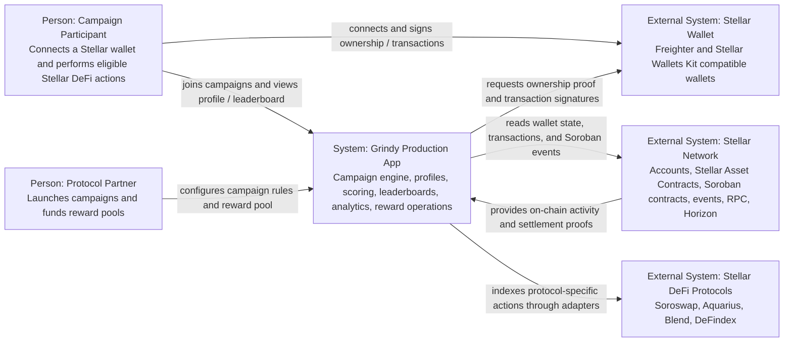
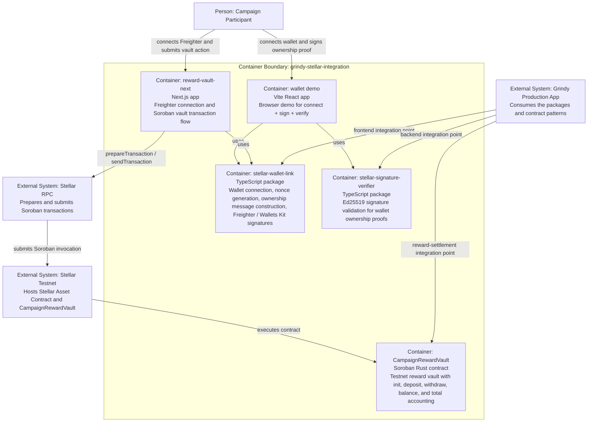
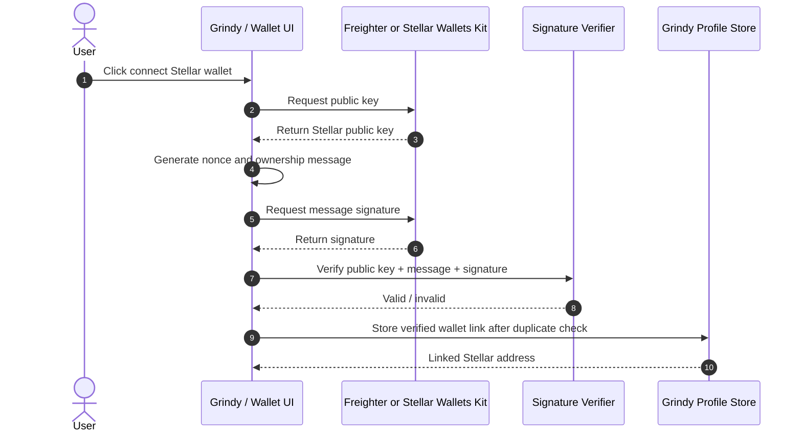
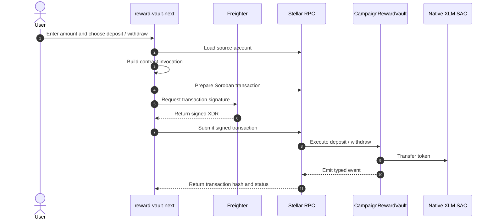
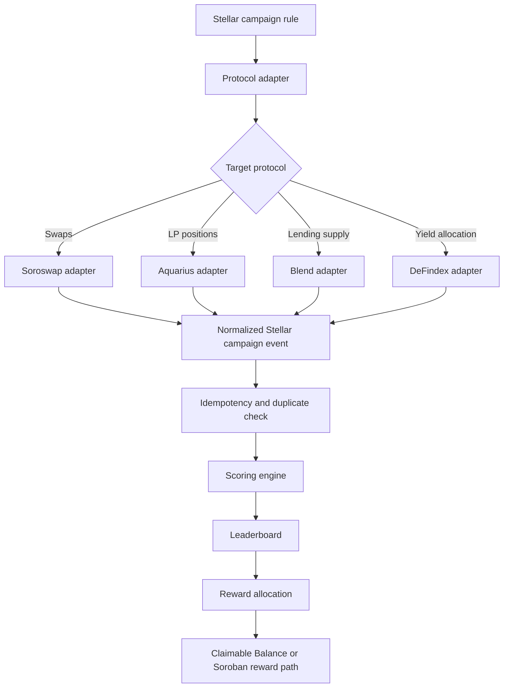

# Grindy x Stellar Technical Architecture

This document describes the public Stellar integration architecture for Grindy. It is written as an engineering source-of-truth for wallet identity, Soroban reward settlement, testnet verification, and the next Stellar DeFi adapter layer.

The production Grindy application already handles campaign setup, user profiles, campaign enrollment, scoring, leaderboards, analytics, and reward operations. This repository exposes only the reusable Stellar modules and testnet proof components that can be reviewed independently.

## 1. Current Public Repository Scope

| Area | Status | Public path |
| --- | --- | --- |
| Stellar wallet connection | Implemented | `packages/stellar-wallet-link` |
| Wallet ownership message | Implemented | `packages/stellar-wallet-link/src/index.ts` |
| Backend-safe signature verifier | Implemented | `packages/stellar-signature-verifier` |
| Wallet ownership browser demo | Implemented | `examples/grindy-stellar-wallet-demo` |
| Soroban reward vault | Implemented | `contracts/campaign-reward-vault` |
| Vault unit test | Implemented | `contracts/campaign-reward-vault/src/lib.rs` |
| Freighter + contract transaction UI | Implemented | `examples/reward-vault-next` |
| Stellar protocol activity adapters | Planned extension | Not implemented in this repository yet |
| Production campaign scoring integration | Production integration point | Not implemented in this repository |

## 2. C4 Context Diagram



## 3. C4 Container Diagram



## 4. End-to-End Data Flow

### 4.1 Wallet Ownership Flow



Public implementation:

- `connectWithStellarWalletsKit`
- `connectWithFreighter`
- `buildOwnershipMessage`
- `signOwnershipMessageWithKit`
- `signOwnershipMessageWithFreighter`
- `verifyStellarOwnershipSignature`

### 4.2 Reward Vault Transaction Flow



Public implementation:

- `examples/reward-vault-next/src/lib/stellar-vault.ts`
- `contracts/campaign-reward-vault/src/lib.rs`

### 4.3 Future Stellar Campaign Indexing Flow



The adapter layer is not implemented in this public repository yet. The intended integration point is to normalize protocol-specific activity into the same campaign-event shape used by Grindy's production scoring and leaderboard engine.

## 5. Contract Specification

### 5.1 Contract Summary

`CampaignRewardVault` is a Soroban testnet contract that demonstrates protocol-funded reward-pool custody for a campaign-like flow. It is intentionally small and auditable:

- no user trading custody
- no hidden admin withdrawal function
- wallet-authenticated `deposit`
- wallet-authenticated `withdraw`
- persistent per-wallet accounting
- typed contract events for indexing

Public path:

- `contracts/campaign-reward-vault/src/lib.rs`

### 5.2 Storage Keys

| Key | Type | Purpose |
| --- | --- | --- |
| `Admin` | `Address` | Contract administrator set during `init`. |
| `Balance(Address)` | `i128` | Per-wallet deposited amount. |
| `Total` | `i128` | Total amount deposited in the vault. |

### 5.3 Public Functions

| Function | Inputs | Auth | Behavior |
| --- | --- | --- | --- |
| `init` | `admin: Address` | `admin.require_auth()` | Initializes contract admin and total balance. Can only run once. |
| `deposit` | `token: Address`, `from: Address`, `amount: i128` | `from.require_auth()` | Transfers tokens from wallet to vault, updates wallet balance and total. |
| `withdraw` | `token: Address`, `to: Address`, `amount: i128` | `to.require_auth()` | Transfers previously deposited tokens from vault back to wallet. |
| `balance` | `user: Address` | none | Reads per-wallet vault balance. |
| `total_deposited` | none | none | Reads total vault balance. |
| `admin` | none | none | Reads configured admin. |

### 5.4 Errors

| Error | Code | Trigger |
| --- | --- | --- |
| `AlreadyInitialized` | `1` | `init` called more than once. |
| `NotInitialized` | `2` | State-changing function called before `init`. |
| `InvalidAmount` | `3` | Amount is zero or negative. |
| `InsufficientBalance` | `4` | Withdraw amount exceeds wallet vault balance. |

### 5.5 Events

| Event | Topics | Data |
| --- | --- | --- |
| `VaultInitialized` | `vault`, `init`, `admin` | none |
| `VaultDeposit` | `vault`, `deposit`, `token`, `wallet` | `amount` |
| `VaultWithdraw` | `vault`, `withdraw`, `token`, `wallet` | `amount` |

### 5.6 Testnet Deployment

| Item | Value |
| --- | --- |
| Network | Stellar testnet |
| Contract ID | `CAIBPSOZD572Z6F7M36W3PWGXP2BNGTAXGPKZFU5DZ3QAQIRQ3MXGFIS` |
| Native token SAC | `CDLZFC3SYJYDZT7K67VZ75HPJVIEUVNIXF47ZG2FB2RMQQVU2HHGCYSC` |
| Admin public key | `GCDWZOFPTZQX7P4GEFK2XRDJVKOFMFFUJK4SOS37IRSKYG5WVTUIRZIT` |
| WASM hash | `8ef2c8f83fa0852593a9228e374b4113ae586b19f3da9a52eba52dcc29b5bc2d` |

Evidence:

- Upload transaction: https://stellar.expert/explorer/testnet/tx/b98d43723ea7978a3aac84f38463c6dc4ad929244fc9158088786357c0dd0c2a
- Deploy transaction: https://stellar.expert/explorer/testnet/tx/2a4e53c86cc612df553c7b1fc21b6b4d8a0860c822ba3736c12b752a9fe386a6
- Init transaction: https://stellar.expert/explorer/testnet/tx/43dd8010fb0558433da0e0d5e5ecf952e0d824cac5872d9347321fbd393c68dd
- Deposit transaction: https://stellar.expert/explorer/testnet/tx/11294adf236564f4ef164b3b1e1778b6ce831809aa8e2a1259623ad29fdfd79c
- Withdraw transaction: https://stellar.expert/explorer/testnet/tx/b096ff71470b13fc3a5c7407dfcc8d6221664766fdd57361ce2e40224529acd5

## 6. Production Integration Points

This repository intentionally avoids production application code. The integration points are stable boundaries that the production app can consume.

| Public module | Production integration point | Responsibility |
| --- | --- | --- |
| `@grindy/stellar-wallet-link` | Profile / wallet settings UI | Connect wallet, build ownership challenge, request signature. |
| `@grindy/stellar-signature-verifier` | Backend wallet-link mutation | Verify signature before persisting a wallet link. |
| `CampaignRewardVault` | Reward settlement service | Provide a Soroban reward-pool primitive for campaign settlement. |
| `reward-vault-next` | Integration reference UI | Demonstrate contract invocation with Freighter and Stellar RPC. |
| Future Stellar adapters | Campaign event ingestion worker | Normalize protocol actions into campaign events. |

## 7. Proposed Data Model Additions

These tables/collections are proposed for the production integration. They are not present in this public repository.

| Model | Key fields | Purpose |
| --- | --- | --- |
| `stellarWalletLinks` | `userId`, `publicKey`, `verifiedAt`, `signatureNonceId` | One verified Stellar wallet per profile or one-to-many if enabled later. |
| `stellarCampaignRules` | `campaignId`, `protocol`, `pool`, `asset`, `eligibleActions`, `startAt`, `endAt` | Defines what on-chain actions count for a campaign. |
| `indexedStellarEvents` | `eventId`, `ledger`, `txHash`, `wallet`, `protocol`, `action`, `amount`, `timestamp` | Stores normalized on-chain actions with idempotency keys. |
| `stellarScores` | `campaignId`, `wallet`, `score`, `lastEventAt` | Holds computed campaign score from normalized events. |
| `stellarRewardVaults` | `campaignId`, `contractId`, `tokenContractId`, `status` | Links a campaign to deployed reward settlement contracts. |
| `stellarSettlements` | `campaignId`, `wallet`, `amount`, `txHash`, `status` | Tracks reward settlement and payout verification. |

## 8. Protocol Adapter Integration Points

The adapter layer should normalize protocol-specific activity into a single event shape:

```ts
type NormalizedStellarCampaignEvent = {
  idempotencyKey: string;
  campaignId: string;
  protocol: "soroswap" | "aquarius" | "blend" | "defindex";
  action: "swap" | "lp_deposit" | "lp_withdraw" | "lending_supply" | "yield_allocate";
  wallet: string;
  asset?: string;
  pool?: string;
  amount?: string;
  txHash: string;
  ledger: number;
  timestamp: string;
};
```

Adapter responsibilities:

- `Soroswap`: routed swaps, eligible pairs, swap volume.
- `Aquarius`: LP deposits, withdrawals, liquidity duration.
- `Blend`: stablecoin supply, lending position duration.
- `DeFindex`: yield allocation, strategy participation duration.

Common requirements:

- deterministic idempotency key
- duplicate event rejection
- ledger cursor checkpointing
- protocol-specific validation
- normalized scoring inputs
- replay-safe backfills

## 9. Security Boundaries

### Wallet ownership

- The ownership message is human-readable.
- It includes domain, user ID, public key, nonce, issue time, and optional expiration.
- The signature does not authorize token transfer.
- The backend must reject expired or reused nonces.
- The backend must reject wallet links already assigned to another profile.

### Soroban vault

- `deposit` requires `from.require_auth()`.
- `withdraw` requires `to.require_auth()`.
- `withdraw` cannot exceed the caller's stored vault balance.
- The contract stores accounting state in persistent storage.
- The current testnet vault is not a full audited production escrow.

### Environment variables

The public Next.js example uses only client-safe variables:

```text
NEXT_PUBLIC_STELLAR_RPC_URL
NEXT_PUBLIC_STELLAR_NETWORK_PASSPHRASE
NEXT_PUBLIC_REWARD_VAULT_CONTRACT_ID
NEXT_PUBLIC_DEMO_TOKEN_CONTRACT_ID
```

No private production credential or backend secret is required by this public repository.

## 10. Verification Commands

Install and validate:

```bash
pnpm install
pnpm check-types
pnpm test
pnpm build
```

Build and test the Soroban contract:

```bash
pnpm contract:test
pnpm contract:build
```

Run the wallet ownership demo:

```bash
pnpm demo
```

Run the reward vault transaction demo:

```bash
pnpm vault:ui
```

Read contract state:

```bash
stellar contract invoke \
  --id CAIBPSOZD572Z6F7M36W3PWGXP2BNGTAXGPKZFU5DZ3QAQIRQ3MXGFIS \
  --source-account <LOCAL_TESTNET_IDENTITY> \
  --network testnet \
  --send no \
  -- total_deposited
```

## 11. Current Limitations

- The public repository contains reusable Stellar integration modules, not the production Grindy application.
- The Soroban contract is a testnet proof, not a full production escrow.
- Protocol adapters for Soroswap, Aquarius, Blend, and DeFindex are defined as integration targets but are not implemented in this public repository yet.
- Production scoring, leaderboard, and reward allocation remain integration points outside this public repository.

## 12. Next Engineering Steps

1. Add production wallet-link persistence using the signature verifier.
2. Add duplicate wallet-link prevention at the backend persistence layer.
3. Add Stellar campaign rule models.
4. Implement Horizon / Stellar RPC event ingestion.
5. Add Soroswap and Aquarius adapters first because swaps and LP duration map directly to existing campaign primitives.
6. Add Blend and DeFindex adapters for stablecoin supply and yield allocation campaigns.
7. Extend reward settlement from the current vault proof toward campaign finalization and reward allocation.
